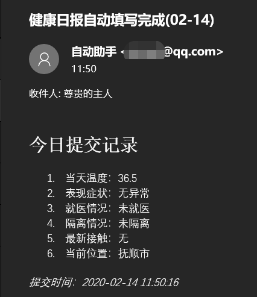

# 【班级魔方】自动提交每日健康情况

## 一、声明

**开源项目！**

**该代码仅供学习交流，请合理使用，出现任何纠纷与作者无关**


## 二、使用方法

使用前，你需要注册好班级魔方账号，并加入指定班级。

其中对“疫情基本情况”的表单没有实现，需要自己网站上手动填写，只需要提交一次即可。

**每天请如实填写自己的身体情况，共战疫情！**


### 2.1 运行环境

- PHP，需要开启curl扩展
- Linux  其他操作系统自己尝试，这里主要是设置自动任务

### 2.2 使用步骤

#### 2.2.1 获取脚本

clone或者上传到服务器（clone前请先安装git）

目录：/home/test/  (可以自己决定，这里仅演示说明)

```shell
cd /home && mkdir test && cd test
git clone git@github.com:Patrick-Jun/Curl-banjimofang.git
```

#### 2.2.2 修改参数

打开文件

```shell
vim ./Curl-banjimofang/auto.php
```

修改如下内容

``` php
$phone = "15600000000";       //登录手机号
$pwd = "12345";               //登录密码

//重点：依次点击 自己班级->健康汇报->每日健康情况，然后复制当前页的浏览器地址url
$suburl = 'http://banjimofang.com/student/course/4914/profiles/29';   

$temp = getTemp(36.3, 37.1);  //体温 36.3~37.2
$sig = "无异常";              //表现症状
$isTri = "未就医";            //就医情况
$isSpl = "未隔离";            //隔离情况
$reTou = "无";               //最新接触
$site = "抚顺市";             //地址
```

> 有同学反馈：一开始使用的微信登录，找不到手机号和密码。 
> **解决** ：手机号是自己微信手机号，密码可以在 http://banjimofang.com/resetpwd/student 进行设置。

#### 2.2.3 创建自动任务

编辑任务，第一次使用会让选择编辑器，选择3，vim-basic

```shell
crontab -e
```

找的一行空白处，添加如下代码
> 其中 00 08 表示每天早上8点进行自动提交，前一个数表示分钟，后一个数表示时钟，可自己调整

```c
00 08 * * * php -f /home/test/Curl-banjimofang/auto.php
```

### 2.3 开启邮件提醒

邮件提醒可以自行决定是否使用，默认不使用



打开文件

```shell
vim ./Curl-banjimofang/auto.php
```

修改如下内容

``` php
//是否需要邮件提示
$isEmail = false;                  //开启邮件提示
$smtpServer = "smtp.qq.com";      //发送者：smtp服务器地址
$smtpPort = 465;                  //发送者：端口号
$email = "xxxxx@qq.com";          //发送者：email账号
$password = "****************";   //发送者：email密码(qq邮箱填授权码)
$name = "自动助手";                //发送者：名称
$reName = "尊贵的主人";            //接收者：名称
$reEmail = "xxxxx@qq.com";        //接收者：email 可以填发送者email，相当于自己给自己发邮件
$title = "健康日报自动填写完成(".date('m-d').")";       //邮件标题
```
> 邮箱默认使用SSL，如果不需要，请修改email.php文件